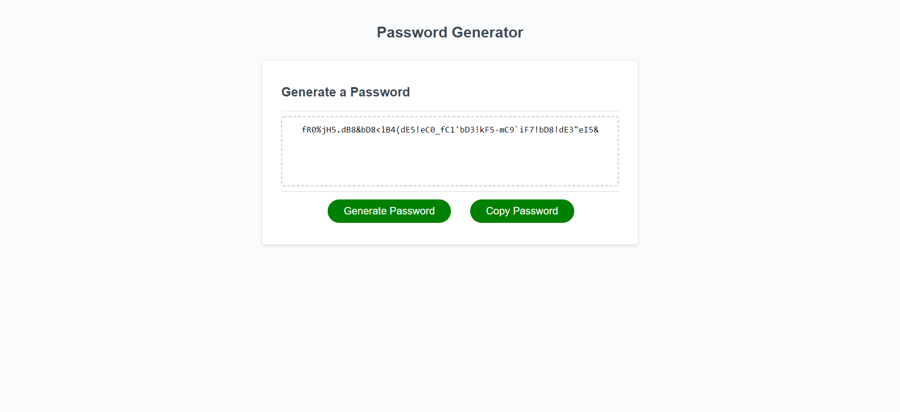

# My-Password-Generator
JavaScript password generator

## Description

This homework helped me learn JavaScript by completing the activities last week such as using script console logs, variables, primitive types (e.g. string, integers, booleans, and undefined), logical comparisons and operators, conditional statements, arrays, iterations, functions, global and local scopes, methods (e.g. arithmetic, comparison, logical operators), objects and properties and using this to get relative properties. These activities help me create a password generator that can be used as a secure password. When the generate password button is clicked, a series of prompts for password criteria including length of the password at least 8 characters and no more than 128 characters, character types to include in the password such as lowercase, uppercase, numeric, and/or special characters. Each prompt input is validated and at least one character type should be selected when all prompts are answered, a password is generated that matches the selected criteria then displayed and written to the page creating a strong password that provides greater security.

## Installation

Using the GitHub account, created a repository and project and pushed the homework files to the repository folder
In GitHub, navigated to jak3ster.github.io repository and click Settings.
Then within Settings, navigate to the Source section within the Github Pages section. 
From the dropdown menu, select master branch and then click Save.

Using the link at https://jak3ster.github.io/My-Password-Generator/.

## Usage

Screenshots added.

